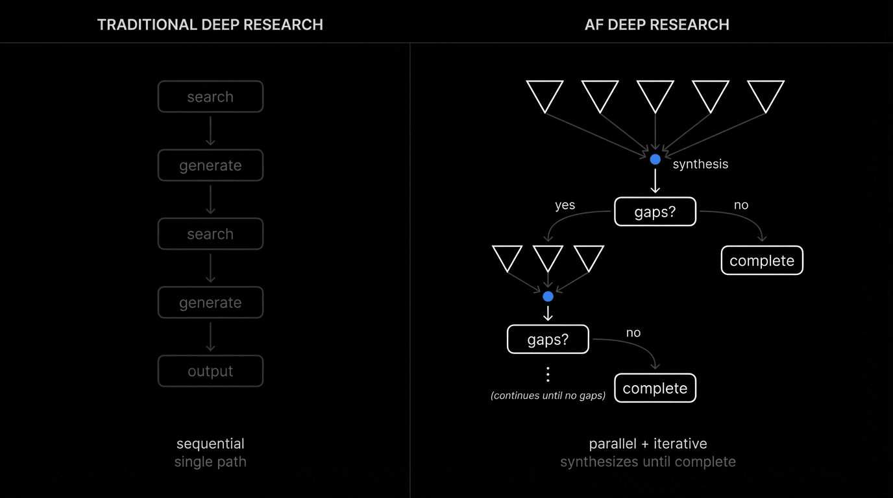

<p align="center">
  <h1 align="center">AF Deep Research</h1>
  <p align="center">Autonomous research backend for AI applications.</p>
</p>
<p align="center">
  <a href="https://github.com/Agent-Field/af-deep-research/blob/main/LICENSE"></a>
  <a href="https://github.com/Agent-Field/agentfield"></a>
  <a href="https://discord.com/invite/aBHaXMkpqh"></a>
</p>
<p align="center"><b>Early Preview</b> · APIs may change. Feedback welcome.</p>

---

A research API that questions itself. Submit a query. The system spawns parallel agents, evaluates what it found against quality thresholds, generates new sub-queries when gaps are detected, and runs another cycle. The architecture orchestrates ~10,000 logical agent invocations per research. This is an [AI backend](https://www.agentfield.ai/blog/posts/ai-backend), not a chat interface.

## Quick start

```bash
git clone https://github.com/Agent-Field/af-deep-research.git && cd af-deep-research
cp .env.example .env
# Add API keys to .env
docker-compose -f docker-compose.hub.yml up -d
```

```bash
curl -X POST http://localhost:8080/api/v1/execute/async/meta_deep_research.execute_deep_research \
  -H "Content-Type: application/json" \
  -d '{"input": {"query": "What companies are investing in AI chips?"}}'
```

Returns `execution_id`. Stream progress via SSE, fetch results when complete.

> Open [localhost:8080/ui](http://localhost:8080/ui) to watch the workflow live.

## Output

The API returns a research package with five components:

| Component | Contents |
|-----------|----------|
| `entities` | Typed objects: Company, Investor, Founder, Technology, Market_Trend, Metric |
| `relationships` | Edges: Competes_With, Invests_In, Partners_With, Founded_By, Acquires |
| `article_evidence` | Facts and quotes with source article IDs |
| `document` | Hierarchical sections with inline citations and bibliography |
| `metadata` | iterations_completed, total_entities, total_relationships, final_quality_score |

<details>
<summary><b>Entities</b></summary>

```json
{
  "entities": [
    {"name": "NVIDIA", "type": "Company", "summary": "Dominant AI chip maker, 80%+ datacenter GPU share"},
    {"name": "Jensen Huang", "type": "Founder", "summary": "CEO of NVIDIA since 1993"},
    {"name": "Sequoia Capital", "type": "Investor", "summary": "Early NVIDIA investor, major AI fund"},
    {"name": "H100", "type": "Technology", "summary": "Flagship AI training GPU, $30k+ ASP"},
    {"name": "AI Chip Market", "type": "Market_Trend", "summary": "Projected $300B by 2030"}
  ]
}
```

</details>

<details>
<summary><b>Relationships</b></summary>

```json
{
  "relationships": [
    {"source": "AMD", "target": "NVIDIA", "type": "Competes_With", "description": "Direct competition in AI accelerators"},
    {"source": "Sequoia Capital", "target": "NVIDIA", "type": "Invests_In", "description": "Series A investor, 1993"},
    {"source": "NVIDIA", "target": "Mellanox", "type": "Acquires", "description": "$7B acquisition for networking"},
    {"source": "Microsoft", "target": "OpenAI", "type": "Partners_With", "description": "$10B strategic investment"}
  ]
}
```

</details>

<details>
<summary><b>Evidence</b></summary>

```json
{
  "article_evidence": [{
    "article_id": 1,
    "facts": [
      "NVIDIA datacenter revenue reached $18.4B in Q4",
      "H100 backlog extends into late 2025"
    ],
    "quotes": ["We are seeing unprecedented demand - Jensen Huang"]
  }]
}
```

</details>

<details>
<summary><b>Document</b></summary>

```json
{
  "document_title": "AI Chip Investment Landscape",
  "executive_summary": "The AI chip market is experiencing...",
  "sections": [
    {"title": "Market Dynamics", "content": "The accelerator market reached $45B [1]..."},
    {"title": "Competitive Landscape", "content": "NVIDIA maintains 80%+ share [2]..."}
  ],
  "source_notes": [
    {"citation_id": 1, "title": "AI Chip Report 2024", "domain": "reuters.com"}
  ]
}
```

</details>

<details>
<summary><b>Metadata</b></summary>

```json
{
  "metadata": {
    "iterations_completed": 3,
    "total_entities": 47,
    "total_relationships": 156,
    "total_sources": 89,
    "final_quality_score": 0.82
  }
}
```

</details>

## How it works

<p align="center">
  
</p>

## What makes this different

Traditional research: one query → retrieve → summarize → done.

This system: **fan out → filter down → synthesize → find gaps → fan out again.**

<p align="center">
  
</p>

Multiple parallel streams explore different angles simultaneously. Each stream filters aggressively—only hyper-relevant evidence survives. Cross-stream synthesis finds patterns. Gap analysis identifies what's missing. New targeted streams spawn. The cycle repeats until quality threshold is met.

| | Perplexity / ChatGPT | AF Deep Research |
|---|---|---|
| **Research process** | One-shot generation | Self-correcting loops that ask "what am I missing?" |
| **Search coverage** | Single query | Multiple parallel streams, each exploring a different angle |
| **What you get back** | Prose with inline links | Structured JSON: typed entities, mapped relationships, cited evidence |
| **Context quality** | Everything retrieved goes to the LLM | Two-tier filtering so only hyper-relevant content reaches the model |
| **Relationship discovery** | Mentioned if obvious | Multi-pass extraction: explicit → implied → indirect → emergent patterns |
| **Scaling** | Fixed behavior | Width and depth scale with query complexity |
| **Integration** | Copy-paste from chat | REST API, SSE streaming, webhook-ready |
| **Deployment** | SaaS only | Self-host with local LLMs, air-gapped option |

### Why it works

- **Context pollution kills quality.** When you dump 50 web pages into an LLM, important facts get buried and the model hallucinates connections. We filter aggressively—hash dedup, semantic dedup, relevance scoring—so only the best evidence reaches synthesis.

- **Width AND depth.** Traditional tools go broad OR deep. This system scales both: `research_scope` controls parallel streams, `research_focus` controls analysis depth. Simple queries get fewer streams; complex queries spawn more.

- **Quality-driven, not count-driven.** The system doesn't run exactly 3 iterations. After each pass it asks: what entities are missing? what relationships are unclear? what claims lack evidence? If gaps exist and are addressable, it continues. If quality threshold is met, it stops.

- **Cross-stream patterns.** The synthesis layer doesn't summarize streams separately—it finds connections between them. A market trend that explains a technical pivot. A team background that validates a GTM strategy.

## API

**Submit:** `POST /api/v1/execute/async/meta_deep_research.execute_deep_research`

**Stream progress:** `GET /api/ui/v1/workflows/{execution_id}/notes/events` (SSE)

**Fetch results:** `GET /api/v1/executions/{execution_id}/result`

### Accessing response data

```python
response = fetch_results(execution_id)

# Graph data
entities = response["research_package"]["entities"]
relationships = response["research_package"]["relationships"]

# Evidence for audits
evidence = response["research_package"]["article_evidence"]

# Document for rendering
sections = response["research_package"]["document"]["sections"]
bibliography = response["research_package"]["document"]["source_notes"]

# Quality gates
if response["metadata"]["final_quality_score"] < 0.7:
    trigger_human_review()
```

## Parameters

| Parameter | What it does |
|-----------|--------------|
| `research_focus` | Depth (1-5). Higher goes deeper. |
| `research_scope` | Breadth (1-5). Higher casts wider net. |
| `max_research_loops` | How many iterative cycles to run. |
| `tension_lens` | `balanced`, `bull`, or `bear` perspective. |
| `source_strictness` | `strict`, `mixed`, or `permissive` source filtering. |

Set `tension_lens: "bear"` for risk-focused analysis. Set `source_strictness: "strict"` to filter to reputable sources only.

## Examples

**Investment research pipeline**
```bash
# Risk analysis for due diligence
curl -X POST http://localhost:8080/api/v1/execute/async/meta_deep_research.execute_deep_research \
  -H "Content-Type: application/json" \
  -d '{"input": {"query": "Rivian competitive position and financial risks", "tension_lens": "bear"}}'

# Response feeds into: risk scoring model, portfolio dashboard, analyst report generator
```

**Knowledge graph builder**
```bash
# Extract entities and relationships for graph database
curl -X POST http://localhost:8080/api/v1/execute/async/meta_deep_research.execute_deep_research \
  -H "Content-Type: application/json" \
  -d '{"input": {"query": "AI chip supply chain: manufacturers, suppliers, customers"}}'

# entities[] → Neo4j nodes
# relationships[] → Neo4j edges
# Now queryable: "Show me all companies 2 hops from NVIDIA"
```

**Competitive intelligence system**
```bash
# Track competitor moves across multiple dimensions
curl -X POST http://localhost:8080/api/v1/execute/async/meta_deep_research.execute_deep_research \
  -H "Content-Type: application/json" \
  -d '{"input": {"query": "How is AMD positioning against NVIDIA in datacenter AI?", "research_scope": 5}}'

# article_evidence[] → feed alerting system
# document → auto-generate weekly competitor brief
```

**Compliance research**
```bash
# Audit-ready research with source tracking
curl -X POST http://localhost:8080/api/v1/execute/async/meta_deep_research.execute_deep_research \
  -H "Content-Type: application/json" \
  -d '{"input": {"query": "ESG practices of major lithium mining companies", "source_strictness": "strict"}}'

# Each fact links to source_notes[] with URL, title, domain
# Audit trail shows exactly where each claim came from
```

## Local LLMs

To keep everything on your network:

```bash
OLLAMA_BASE_URL=http://host.docker.internal:11434
DEFAULT_MODEL=ollama/llama3.2
```

> No telemetry. Your data stays on your infrastructure.

<details>
<summary>Model options</summary>

| Model | Cost |
|-------|------|
| `deepseek-chat-v3.1` | $0.15/0.75 per 1M tokens |
| `claude-sonnet-4` | $3/$15 per 1M tokens |
| `ollama/llama3.2` | Free (local) |
| `ollama/qwen2.5:72b` | Free (local) |

</details>

## The stack

Runs on [AgentField](https://github.com/Agent-Field/agentfield), open-source infrastructure for production AI agents. Workflows run for 16+ minutes without timeout. Progress streams via SSE. Results persist. Audit trails are cryptographically signed for compliance.

<p align="center">
  <a href="https://github.com/Agent-Field/agentfield"></a>
</p>

## Links

- [Docs](https://agentfield.ai/docs)
- [GitHub](https://github.com/Agent-Field/agentfield)
- [Discord](https://discord.com/invite/aBHaXMkpqh)

## Contribute

This is an early preview. We're actively developing and want feedback. File issues, open PRs, or come chat in [Discord](https://discord.com/invite/aBHaXMkpqh).

<p align="center">
  <sub>Built by <a href="https://agentfield.ai">AgentField</a> · <a href="https://github.com/Agent-Field/af-deep-research/blob/main/LICENSE">Apache 2.0</a></sub>
</p>
