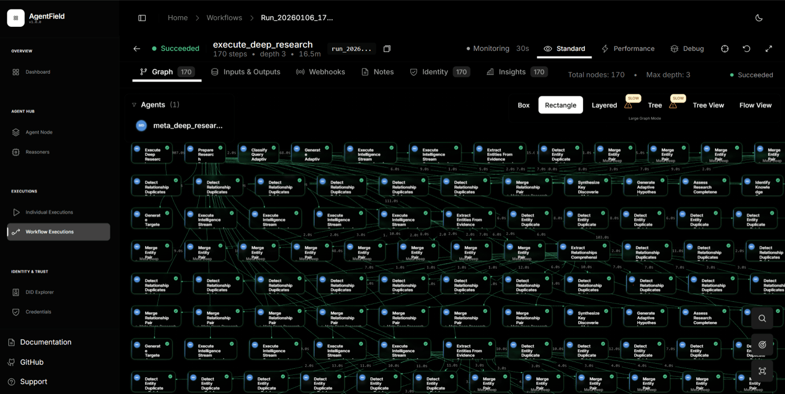

<p align="center">
  <h1 align="center">Deep Research</h1>
  <p align="center">
    <strong>One query. Hundreds of reasoning agents. Structured output.</strong>
  </p>
</p>

<p align="center">
  <a href="https://github.com/Agent-Field/af-deep-research/stargazers"></a>
  <a href="https://github.com/Agent-Field/af-deep-research/blob/main/LICENSE"></a>
  <a href="https://github.com/Agent-Field/agentfield"></a>
</p>

---

You send a query. The system dynamically spawns parallel research agents—entity extractors, relationship mappers, evidence synthesizers, gap detectors—all working simultaneously. When gaps are found, more agents spin up to fill them. The output: a structured knowledge graph, entity relationships, and a cited document.


*A single query spawning 170+ parallel reasoning agents across entity extraction, relationship mapping, evidence synthesis, and document generation.*

**One real query produced:** 57 entities, 351 relationships, 93 sources, 3 iterative refinement cycles.

---

## Quick Start

```bash
git clone https://github.com/Agent-Field/af-deep-research.git && cd af-deep-research
cp .env.example .env  # add your API keys
docker-compose -f docker-compose.hub.yml up -d

curl -X POST http://localhost:8080/api/v1/execute/async/meta_deep_research.execute_deep_research \
  -H "Content-Type: application/json" \
  -d '{"input": {"query": "What is the current state of quantum computing startups?"}}'
```

You get back `execution_id` and `run_id`. Stream real-time progress via SSE. Fetch structured results when done.

---

## What You Actually Get

```json
{
  "entities": [
    {"name": "IonQ", "type": "Company", "summary": "..."},
    {"name": "IBM Quantum", "type": "Product", "summary": "..."}
  ],
  "relationships": [
    {"source": "IonQ", "target": "Amazon Braket", "type": "Partners_With"},
    {"source": "Google", "target": "IonQ", "type": "Competes_With"}
  ],
  "document": "# Quantum Computing Startups: 2025 Landscape\n\n## Executive Summary...",
  "key_discoveries": ["..."],
  "source_articles": [{"url": "...", "relevance_score": 0.92}]
}
```

Entities. Relationships. Knowledge graphs. Cited documents. Evidence chains. All structured, all typed, all ready for your application.

---

## Why This Exists

| | Search Tools | Deep Research |
|---|---|---|
| **Process** | Search once, summarize | Search → find gaps → research again → repeat |
| **Output** | Text blob | Structured knowledge graph + document |
| **Integration** | Chat window | REST API, SSE streaming |
| **Agents** | Single pass | Dynamically spawned parallel agents |

Most tools search once and summarize. That's a book report.

Deep Research runs iterative loops. Each cycle spawns specialized agents—for entity extraction, relationship mapping, evidence gathering. Gap detection triggers targeted follow-up research. The system decides what's missing and goes after it.

---

## Build On It

This is an API. Build whatever you want on top.

**Stream progress to your own UI:**
```bash
curl -N http://localhost:8080/api/ui/v1/workflows/{run_id}/notes/events
```

```
data: {"type":"note","data":{"message":"Spawning 4 parallel research streams..."}}
data: {"type":"note","data":{"message":"Entity extraction: found 23 companies..."}}
data: {"type":"note","data":{"message":"Gap detected: missing funding data. Researching..."}}
data: {"type":"note","data":{"message":"Building relationship graph..."}}
```

Tap into SSE events and build your own frontend. Embed research in your existing workflows. Pull entity data into your CRM. Feed relationships into your graph database. Whatever makes sense for your use case.

**Control the research:**

| Parameter | What it does |
|-----------|--------------|
| `research_focus` | Depth (1-5). Higher = more thorough |
| `research_scope` | Breadth (1-5). Higher = wider coverage |
| `max_research_loops` | How many iterative cycles |
| `num_parallel_streams` | Parallel research angles |
| `tension_lens` | `balanced` / `bull` / `bear` perspective |
| `source_strictness` | `strict` / `mixed` / `permissive` |

---

## The Stack

```
┌─────────────────────────────────────────────────────────────┐
│                    YOUR APPLICATION                         │
│            (REST calls, SSE streaming, webhooks)            │
└─────────────────────────────────┬───────────────────────────┘
                                  │
                                  ▼
┌─────────────────────────────────────────────────────────────┐
│                 AGENTFIELD CONTROL PLANE                    │
│     Async execution • Agent routing • SSE • Observability   │
└─────────────────────────────────┬───────────────────────────┘
                                  │
                                  ▼
┌─────────────────────────────────────────────────────────────┐
│                   DEEP RESEARCH AGENT                       │
│  Dynamically spawns: extractors, mappers, synthesizers,     │
│  gap detectors, document generators                         │
└─────────────────────────────────┬───────────────────────────┘
                                  │
                                  ▼
┌─────────────────────────────────────────────────────────────┐
│   LLMs (OpenRouter/Ollama)  •  Search (Jina/Tavily/Serper)  │
└─────────────────────────────────────────────────────────────┘
```

---

## Built on AgentField

Deep Research runs on [AgentField](https://github.com/Agent-Field/agentfield)—open-source infrastructure for production AI agents.

Why that matters:
- **16+ minute workflows** that don't timeout (no Lambda limits)
- **SSE streaming** for real-time progress to your UI
- **Async execution** with webhook callbacks
- **Horizontal scaling** across distributed agent nodes

This is what [AI Backend infrastructure](https://www.agentfield.ai/blog/posts/ai-backend) looks like in practice.

<p align="center">
  <a href="https://github.com/Agent-Field/agentfield">
    
  </a>
</p>

---

## Enterprise Ready

Run everything locally. Your queries, your data, your infrastructure.

**Privacy & Deployment:**
- Local LLMs via Ollama—no API calls leaving your network
- Air-gapped deployments with fully offline operation
- No telemetry. We don't phone home.

**Security & Compliance (via AgentField):**
- Cryptographic agent identity (W3C DIDs)
- Tamper-proof audit trails (Verifiable Credentials)
- Infrastructure-level access control and policy enforcement

Building internal research tools, competitive intelligence, or regulated industry applications? This stack is built for that.

---

## Configuration

```bash
# .env
OPENROUTER_API_KEY=sk-or-...     # or use Ollama locally
JINA_API_KEY=jina_...            # pick one search provider

# Optional: local models
OLLAMA_BASE_URL=http://host.docker.internal:11434
DEFAULT_MODEL=ollama/llama3.2
```

Default model: `deepseek-chat-v3.1` ($0.15/$0.75 per 1M tokens). Works great.

<details>
<summary><b>Model options</b></summary>

| Model | Cost | Notes |
|-------|------|-------|
| `openrouter/deepseek/deepseek-chat-v3.1` | $0.15/0.75 | Default. Good value. |
| `openrouter/anthropic/claude-sonnet-4` | $3/$15 | Higher quality synthesis |
| `openrouter/google/gemini-2.5-flash` | $0.30/$2.50 | Faster |
| `ollama/llama3.2` | Free | Local, good for testing |
| `ollama/qwen2.5:72b` | Free | Local, excellent structured output |

</details>

<details>
<summary><b>Local Ollama setup</b></summary>

```bash
ollama run llama3.2

# .env
OLLAMA_BASE_URL=http://host.docker.internal:11434
DEFAULT_MODEL=ollama/llama3.2
```

For Docker: use `host.docker.internal` instead of `localhost`.

</details>

---

## Use Cases

<details>
<summary><b>Market Intelligence</b></summary>

```json
{
  "query": "Top 10 AI infrastructure startups and their competitive positioning",
  "research_focus": 4,
  "research_scope": 4
}
```
→ Company profiles, funding data, competitive relationships, market positioning.
</details>

<details>
<summary><b>Technical Research</b></summary>

```json
{
  "query": "Current approaches to solving LLM hallucination",
  "research_focus": 5,
  "source_strictness": "strict"
}
```
→ Technical approaches, papers, implementations, effectiveness comparisons.
</details>

<details>
<summary><b>Investment Diligence</b></summary>

```json
{
  "query": "Autonomous vehicle industry: key players, technology moats, risks",
  "tension_lens": "bear"
}
```
→ Risk-focused analysis, entity relationships, funding flows.
</details>

---

## Roadmap

- [x] Iterative research with gap detection
- [x] Multi-provider search (Jina, Tavily, Firecrawl, Serper)
- [x] Real-time SSE streaming
- [x] Knowledge graph extraction
- [ ] Python SDK
- [ ] Research templates
- [ ] Academic paper integration (Semantic Scholar, arXiv)
- [ ] Export formats (PDF, DOCX)

---

## Troubleshooting

```bash
docker-compose ps          # check status
docker-compose logs -f     # stream logs
docker-compose restart     # restart
```

<details>
<summary>Agent not registering?</summary>

Takes 10-15 seconds after startup. Check `http://localhost:8080`.
</details>

<details>
<summary>Rate limits?</summary>

Reduce `num_parallel_streams` or `research_scope`.
</details>

---

## Built Something?

Using Deep Research in your product, internal tool, or workflow? We'd love to hear about it.

- **Get featured**: We showcase interesting implementations
- **Contribute**: PRs welcome—new search providers, output formats, research templates
- **Join the community**: [AgentField Discord](https://discord.com/invite/aBHaXMkpqh)

Open an issue, drop a message in Discord, or just star the repo and ship.

---

## License

MIT

---

<p align="center">
  <a href="https://github.com/Agent-Field/af-deep-research">⭐ Star if this saves you research time</a><br>
  <sub>Built by <a href="https://agentfield.ai">AgentField</a></sub>
</p>
