<p align="center">
  <h1 align="center">Deep Research API</h1>
  <p align="center">
    <strong>Programmatic deep research for your applications.</strong><br>
    Not a chatbot—an API that researches like an analyst.
  </p>
</p>

<p align="center">
  <a href="https://github.com/Agent-Field/af-deep-research/stargazers"></a>
  <a href="https://github.com/Agent-Field/af-deep-research/blob/main/LICENSE"></a>
  <a href="https://github.com/Agent-Field/agentfield"></a>
  <a href="#"></a>
</p>

<p align="center">
  
  
  
  
</p>


*A single research query spawns 170+ parallel reasoning steps - entity extraction, relationship mapping, evidence synthesis, and document generation.*

---

## Why This Exists

ChatGPT and Perplexity give you **chat interfaces**. You get answers, but you can't build on them.

Deep Research API gives you **infrastructure**:
- **API-first**: Integrate research into your apps, pipelines, and workflows
- **Iterative**: Automatically finds gaps, researches again, refines—like a human analyst
- **Structured output**: Get entities, relationships, and evidence—not just text

```
One query → Multi-angle research → Gap analysis → Refined research →
Structured knowledge graph + Cited document
```

---

## How It Works

```mermaid
flowchart TB
    subgraph CLIENT ["📱 YOUR APPLICATION"]
        Q[/"Research Query"/]
        R[("Results")]
    end

    subgraph CONTROL ["⚡ AGENTFIELD CONTROL PLANE"]
        direction LR
        API["REST API"]
        SSE["SSE Stream"]
        ORCH["Orchestrator"]
    end

    subgraph AGENT ["🔬 DEEP RESEARCH AGENT"]
        direction TB

        subgraph PHASE1 ["Phase 1: Research Collection"]
            CLASS["Query Classification"]
            STREAMS["Parallel Research Streams"]
            EXTRACT["Evidence Extraction"]
            GRAPH["Entity & Relationship Mapping"]
        end

        subgraph LOOP ["🔄 ITERATIVE REFINEMENT"]
            EVAL["Quality Evaluation"]
            GAP["Gap Analysis"]
            TARGET["Targeted Re-search"]
        end

        subgraph PHASE2 ["Phase 2: Document Generation"]
            FILTER["Source Adjudication"]
            SYNTH["Synthesis & Citations"]
            DOC["Final Document"]
        end
    end

    subgraph EXTERNAL ["🌐 EXTERNAL SERVICES"]
        LLM["LLMs via OpenRouter"]
        SEARCH["Web Search APIs"]
    end

    Q -->|"POST /execute"| API
    API --> ORCH
    ORCH --> CLASS
    CLASS --> STREAMS
    STREAMS --> EXTRACT
    EXTRACT --> GRAPH
    GRAPH --> EVAL

    EVAL -->|"Gaps Found"| GAP
    GAP --> TARGET
    TARGET --> STREAMS

    EVAL -->|"Quality ✓"| FILTER
    FILTER --> SYNTH
    SYNTH --> DOC

    DOC --> R

    ORCH -.->|"Real-time progress"| SSE
    SSE -.->|"SSE Events"| CLIENT

    STREAMS <--> SEARCH
    CLASS & EXTRACT & SYNTH <--> LLM

    style LOOP fill:#e8f5e9,stroke:#4caf50,stroke-width:2px
    style SSE fill:#e3f2fd,stroke:#2196f3,stroke-width:2px
    style STREAMS fill:#fff3e0,stroke:#ff9800,stroke-width:2px
```



### The Iterative Difference


---

## Quick Start

```bash
# 1. Clone & configure
git clone https://github.com/Agent-Field/af-deep-research.git && cd af-deep-research
cp .env.example .env  # Add your API keys

# 2. Start
docker-compose -f docker-compose.hub.yml up -d

# 3. Research
curl -X POST http://localhost:8080/api/v1/execute/async/meta_deep_research.execute_deep_research \
  -H "Content-Type: application/json" \
  -d '{"input": {"query": "What is the current state of quantum computing startups?"}}'
```

**That's it.** You get back an `execution_id` and `run_id`. Subscribe to real-time progress via SSE, then fetch your structured results.

---

## What You Get

| Output | Description |
|--------|-------------|
| **Cited Document** | Publication-ready markdown with inline citations |
| **Knowledge Graph** | Entities (companies, people, technologies) + relationships |
| **Evidence Chain** | Facts and quotes traced to source articles |
| **Key Discoveries** | Synthesized insights and core thesis |
| **Source Archive** | All articles with relevance scores |

<details>
<summary><b>Example Response Structure</b></summary>

```json
{
  "status": "succeeded",
  "result": {
    "research_package": {
      "document": "# Quantum Computing Startups: 2025 Landscape\n\n## Executive Summary...",
      "core_thesis": "Quantum computing startups are transitioning from research to commercialization...",
      "key_discoveries": [
        "IonQ and Rigetti lead in hardware, but software startups are gaining ground",
        "Enterprise adoption focused on optimization and cryptography use cases"
      ],
      "entities": [
        {"name": "IonQ", "type": "Company", "summary": "Public quantum hardware company..."},
        {"name": "IBM Quantum", "type": "Product", "summary": "Cloud quantum computing platform..."}
      ],
      "relationships": [
        {"source": "IonQ", "target": "Amazon Braket", "type": "Partners_With"},
        {"source": "Google", "target": "IonQ", "type": "Competes_With"}
      ],
      "source_articles": [...],
      "article_evidence": [...]
    }
  }
}
```
</details>

---

## Deep Research vs. The Rest

| Capability | Deep Research API | ChatGPT | Perplexity | Tavily |
|------------|-------------------|---------|------------|--------|
| **Programmatic API** | ✅ Full REST API | ❌ Chat only | ⚠️ Limited | ✅ |
| **Iterative refinement** | ✅ Auto gap analysis | ❌ Single pass | ❌ Single pass | ❌ |
| **Knowledge graph output** | ✅ Entities + relations | ❌ | ❌ | ❌ |
| **Multi-stream parallel** | ✅ 2-4 angles | ❌ | ❌ | ❌ |
| **Perspective control** | ✅ Bull/Bear/Balanced | ❌ | ❌ | ❌ |
| **Real-time streaming** | ✅ SSE events | ⚠️ Token stream | ❌ | ❌ |
| **Self-hostable** | ✅ Docker | ❌ | ❌ | ❌ |
| **Evidence traceability** | ✅ Full chain | ⚠️ Basic | ✅ | ⚠️ |

---

<details>
<summary><strong>Example: Full Research Output</strong> (click to expand)</summary>

Below is a real response from the query *"What is the current state of quantum computing startups?"* — completed in ~16 minutes with 170 reasoning steps, 57 entities, 351 relationships, and 93 sources.

```json
{
  "execution_id": "exec_20260106_172519_6hqcvbe5",
  "run_id": "run_20260106_172519_od6wrp6g",
  "status": "succeeded",
  "result": {
    "mode": "general",
    "version": "1.0.0",
    "metadata": {
      "query": "What is the current state of quantum computing startups?",
      "total_orchestration_time_seconds": 990.02,
      "research_phase_metadata": {
        "iterations_completed": 3,
        "total_entities": 57,
        "total_relationships": 351,
        "total_sources": 93,
        "final_quality_score": 0.7,
        "iteration_summaries": [
          "Iteration 1: +19 entities, +85 relationships (381.3s)",
          "Iteration 2: +9 entities, +137 relationships (224.0s)",
          "Iteration 3: +29 entities, +129 relationships (234.8s)"
        ]
      }
    },
    "research_package": {
      "document_title": "Quantum Computing Startup Landscape Blueprint",
      "executive_summary": "The executive summary of the research document reveals a symbiotic relationship between hardware and software advancements in quantum computing startups, where breakthroughs in one area significantly accelerate the other, driving market growth and providing a competitive edge. Key findings include hardware driving software innovation and software pushing hardware boundaries, with startups benefiting from this symbiosis. Notably, the rapid progress in quantum machine learning and optimization algorithms, such as VQE and QAOA, demonstrates the strides made in quantum software, which in turn requires more advanced hardware. The document also highlights the increasing competition and investment in the quantum computing landscape, with major players like IBM, Google, and Microsoft leading the way.",
      "disclaimers": [
        "Caution: This research may rely on unverified sources.",
        "Note: This study's findings may be contentious due to a high peak disagreement score."
      ],
      "sections": [
        {
          "title": "The Symbiotic Relationship between Hardware and Software",
          "content": "# The Symbiotic Relationship between Hardware and Software\n\nThe development of quantum hardware and software in startups is not two separate races, but a symbiotic dance. Advancements in one area significantly accelerate the other, creating a mutually beneficial relationship that drives market growth and provides a competitive advantage.\n\n## Key Findings\n\n1. **Hardware Drives Software Innovation**\n   - Breakthroughs in quantum hardware, such as those by Google and IBM, pave the way for advanced quantum software and algorithms.\n   - More powerful hardware enables the development of more complex and efficient quantum software and algorithms.\n\n2. **Software Pushes Hardware Boundaries**\n   - Advancements in quantum software and algorithms push the limits of current hardware.\n   - These advancements require more powerful hardware to run effectively, driving hardware innovation.\n\n## Rapid Progress in Quantum Machine Learning and Optimization\n\n| Algorithm/Tool | Developer | Key Features |\n| --- | --- | --- |\n| Variational Quantum Eigensolver (VQE) | IBM, Google, Rigetti | Solves complex optimization problems |\n| Quantum Approximate Optimization Algorithm (QAOA) | Google, IBM | Solves combinatorial optimization problems |\n| Quantum Machine Learning (QML) | IBM, Microsoft, Zapata Computing | Applies quantum principles to machine learning |"
        },
        {
          "title": "Growth and Competition in the Quantum Computing Landscape",
          "content": "# Growth and Competition in the Quantum Computing Landscape\n\n## Increasing Major Players\n\nThe quantum computing landscape has witnessed a significant influx of major players, growing from 21 companies in 2020 to 76 in 2025. This rapid expansion underscores the immense potential and attractiveness of the market.\n\n## Top 10 Leading Quantum Computing Companies in 2025\n\n| Rank | Company | Quantum Volume (Estimated) | Funding Raised (USD Billion) |\n| --- | --- | --- | --- |\n| 1 | IBM Quantum | 127 | 15 |\n| 2 | Google Quantum AI | 64 | 12 |\n| 3 | Microsoft Quantum | 48 | 10 |\n| 4 | IonQ | 32 | 8 |\n| 5 | Rigetti Computing | 24 | 7 |\n| 6 | D-Wave Systems | 16 | 6 |\n| 7 | Honeywell Quantum Solutions | 12 | 5 |\n| 8 | Quantinuum | 8 | 4 |\n| 9 | Quantum Circuits Inc. | 4 | 3 |\n| 10 | Pasqal | 2 | 2 |"
        },
        {
          "title": "Key Collaborations between Hardware and Software Startups",
          "content": "..."
        },
        {
          "title": "Investment Trends in Quantum Computing Startups",
          "content": "..."
        }
      ],
      "source_notes": [
        {
          "citation_id": 1,
          "title": "Google & IBM: New Age of Quantum Computing is About to Begin",
          "domain": "technologymagazine.com",
          "url": "https://technologymagazine.com/news/google-ibm-new-age-of-quantum-computing-is-about-to-begin"
        },
        {
          "citation_id": 2,
          "title": "Good Old IBM Is Leading the Way in the Race for Quantum...",
          "domain": "wsj.com",
          "url": "https://www.wsj.com/tech/ibm-quantum-computer-b443bf5c"
        },
        {
          "citation_id": 3,
          "title": "Quantum Computing Companies in 2025 (76 Major Players)",
          "domain": "thequantuminsider.com",
          "url": "https://thequantuminsider.com/2025/09/23/top-quantum-computing-companies/"
        }
      ]
    }
  },
  "started_at": "2026-01-06T17:25:19Z",
  "completed_at": "2026-01-06T17:41:49Z",
  "duration_ms": 990047
}
```

</details>

## API Reference

### Start Research

```bash
POST /api/v1/execute/async/meta_deep_research.execute_deep_research
```

```json
{
  "input": {
    "query": "Your research question",
    "research_focus": 3,
    "research_scope": 3,
    "max_research_loops": 3,
    "num_parallel_streams": 2,
    "tension_lens": "balanced",
    "source_strictness": "mixed"
  }
}
```

| Parameter | Default | Description |
|-----------|---------|-------------|
| `query` | *required* | Research question |
| `research_focus` | `3` | Depth 1-5 (1=surface, 5=deep) |
| `research_scope` | `3` | Breadth 1-5 (1=narrow, 5=wide) |
| `max_research_loops` | `3` | Iterative refinement cycles |
| `num_parallel_streams` | `2` | Parallel research angles |
| `tension_lens` | `balanced` | `balanced` / `bull` / `bear` |
| `source_strictness` | `mixed` | `strict` / `mixed` / `permissive` |

### Stream Progress (SSE)

```bash
curl -N http://localhost:8080/api/ui/v1/workflows/{run_id}/notes/events
```

```
data: {"type":"note","data":{"message":"Starting multi-stream research..."}}
data: {"type":"note","data":{"message":"Found 23 relevant articles"}}
data: {"type":"note","data":{"message":"Gap analysis: researching funding data..."}}
data: {"type":"note","data":{"message":"Generating final document..."}}
```

### Get Results

```bash
GET /api/v1/executions/{execution_id}
```

---

## Configuration

### Required API Keys

```bash
# .env
OPENROUTER_API_KEY=sk-or-...     # Required (not needed if using Ollama)
JINA_API_KEY=jina_...            # Pick one search provider
# TAVILY_API_KEY=tvly-...
# FIRECRAWL_API_KEY=fc-...
# SERPER_API_KEY=...

# Optional: Use local Ollama instead of OpenRouter
# OLLAMA_BASE_URL=http://host.docker.internal:11434
# DEFAULT_MODEL=ollama/llama3.2
```

### Model Selection

Default: `openrouter/deepseek/deepseek-chat-v3.1` ($0.15/$0.75 per 1M tokens)

| Tier | Model | Cost | Use Case |
|------|-------|------|----------|
| **Budget** | `openrouter/deepseek/deepseek-chat-v3.1` | $0.15/0.75 | Default, excellent value |
| **Premium** | `openrouter/anthropic/claude-sonnet-4` | $3/$15 | Higher quality synthesis |
| **Fast** | `openrouter/google/gemini-2.5-flash` | $0.30/$2.50 | Lower latency |

```bash
echo 'DEFAULT_MODEL=openrouter/anthropic/claude-sonnet-4' >> .env
docker-compose restart
```

---

## Built on AgentField

<p align="center">
  <a href="https://github.com/Agent-Field/agentfield">
    
  </a>
</p>

Deep Research API runs on [**AgentField**](https://github.com/Agent-Field/agentfield)—the open-source control plane for production AI agents.

```mermaid
flowchart LR
    subgraph YOUR_APP ["Your Application"]
        APP["Backend / Frontend"]
    end

    subgraph AF ["AgentField Control Plane"]
        direction TB
        ROUTING["Agent Routing"]
        ASYNC["Async Execution"]
        STATE["Durable State"]
        OBSERVE["Observability"]
    end

    subgraph AGENTS ["Agent Ecosystem"]
        DR["🔬 Deep Research"]
        OTHER1["📊 Data Analysis"]
        OTHER2["🤖 Custom Agents"]
    end

    APP <-->|"REST API"| AF
    AF <--> DR
    AF <--> OTHER1
    AF <--> OTHER2

    style AF fill:#f3e5f5,stroke:#8e24aa,stroke-width:2px
    style DR fill:#e8f5e9,stroke:#4caf50,stroke-width:2px
```



**Why AgentField?**
- **Production-ready**: Async execution, webhooks, SSE streaming out of the box
- **Observable**: Workflow DAGs, Prometheus metrics, structured logs
- **Scalable**: Stateless control plane, distributed agent nodes
- **Extensible**: Add your own agents alongside Deep Research

[**→ Learn more about AgentField**](https://github.com/Agent-Field/agentfield)

---

## Use Cases

<details>
<summary><b>🏢 Market Intelligence</b></summary>

```json
{
  "query": "Who are the top 10 AI infrastructure startups and their competitive positioning?",
  "research_focus": 4,
  "research_scope": 4,
  "tension_lens": "balanced"
}
```
Returns: Company profiles, funding data, competitive relationships, market positioning analysis.
</details>

<details>
<summary><b>🔬 Technical Research</b></summary>

```json
{
  "query": "What are the current approaches to solving LLM hallucination?",
  "research_focus": 5,
  "research_scope": 3,
  "source_strictness": "strict"
}
```
Returns: Technical approaches, research papers, implementation examples, effectiveness comparisons.
</details>

<details>
<summary><b>📈 Investment Diligence</b></summary>

```json
{
  "query": "Analyze the autonomous vehicle industry: key players, technology moats, and risks",
  "research_focus": 4,
  "research_scope": 5,
  "tension_lens": "bear"
}
```
Returns: Risk-focused analysis with entity relationships, funding flows, and competitive dynamics.
</details>

---

## Roadmap

- [x] Core research pipeline with iterative refinement
- [x] Multi-provider search (Jina, Tavily, Firecrawl, Serper)
- [x] Real-time SSE streaming
- [x] Knowledge graph extraction
- [ ] Python SDK (`pip install af-deep-research`)
- [ ] Research templates (market analysis, technical review, etc.)
- [ ] Multi-agent research coordination
- [ ] Academic paper integration (Semantic Scholar, arXiv)
- [ ] Export formats (PDF, DOCX, Notion)

---

## Local Ollama Configuration

You can use a local [Ollama](https://ollama.ai) deployment instead of OpenRouter. This is useful for:

- Air-gapped environments
- Cost savings with local hardware
- Testing with self-hosted LLaMA models

### Setup

1. **Start Ollama** on your host machine with a model:

```bash
ollama run llama3.2
```

2. **Configure your `.env`**:

```bash
# Point to Ollama (use host.docker.internal for Docker to reach host)
OLLAMA_BASE_URL=http://host.docker.internal:11434
DEFAULT_MODEL=ollama/llama3.2

# OpenRouter key not needed when using Ollama
# OPENROUTER_API_KEY=...
```

3. **Restart the service**:

```bash
docker-compose down && docker-compose up -d
```

### Recommended Ollama Models

| Model | Command | Parameters | Notes |
| ----- | ------- | ---------- | ----- |
| Llama 3.2 | `ollama run llama3.2` | 3B | Fast, good for testing |
| Llama 3.1 8B | `ollama run llama3.1:8b` | 8B | Good balance |
| Llama 3.1 70B | `ollama run llama3.1:70b` | 70B | High quality (needs ~40GB VRAM) |
| Qwen 2.5 72B | `ollama run qwen2.5:72b` | 72B | Excellent structured output |
| DeepSeek R1 | `ollama run deepseek-r1:14b` | 14B | Reasoning model |

> **Note**: For Docker deployments, use `host.docker.internal` instead of `localhost` to reach Ollama running on your host machine.

## Troubleshooting

```bash
docker-compose ps          # Check service status
docker-compose logs -f     # Stream logs
docker-compose restart     # Restart services
```

<details>
<summary>Agent not registering?</summary>

The agent takes 10-15 seconds to register after startup. Check `http://localhost:8080` for the AgentField UI.
</details>

<details>
<summary>Rate limiting issues?</summary>

The system batches API calls (max 20 concurrent). If hitting limits, reduce `num_parallel_streams` or `research_scope`.
</details>

---

## Contributing

We welcome contributions! See [CONTRIBUTING.md](CONTRIBUTING.md) for guidelines.

---

## License

MIT License - see [LICENSE](LICENSE) for details.

---

<p align="center">
  <b>If this saves you research time, consider giving it a ⭐</b><br>
  <a href="https://github.com/Agent-Field/af-deep-research">Star on GitHub</a>
</p>
