<p align="center">
  <h1 align="center">Deep Research API</h1>
  <p align="center">
    <strong>Programmatic deep research for your applications.</strong><br>
    Not a chatbot—an API that researches like an analyst.
  </p>
</p>

<p align="center">
  <a href="https://github.com/Agent-Field/af-deep-research/stargazers"></a>
  <a href="https://github.com/Agent-Field/af-deep-research/blob/main/LICENSE"></a>
  <a href="https://github.com/Agent-Field/agentfield"></a>
  <a href="#"></a>
</p>

<p align="center">
  
  
  
  
</p>

---

## Why This Exists

ChatGPT and Perplexity give you **chat interfaces**. You get answers, but you can't build on them.

Deep Research API gives you **infrastructure**:
- **API-first**: Integrate research into your apps, pipelines, and workflows
- **Iterative**: Automatically finds gaps, researches again, refines—like a human analyst
- **Structured output**: Get entities, relationships, and evidence—not just text

```
One query → Multi-angle research → Gap analysis → Refined research →
Structured knowledge graph + Cited document
```

---

## How It Works

```mermaid
flowchart TB
    subgraph CLIENT ["📱 YOUR APPLICATION"]
        Q[/"Research Query"/]
        R[("Results")]
    end

    subgraph CONTROL ["⚡ AGENTFIELD CONTROL PLANE"]
        direction LR
        API["REST API"]
        SSE["SSE Stream"]
        ORCH["Orchestrator"]
    end

    subgraph AGENT ["🔬 DEEP RESEARCH AGENT"]
        direction TB

        subgraph PHASE1 ["Phase 1: Research Collection"]
            CLASS["Query Classification"]
            STREAMS["Parallel Research Streams"]
            EXTRACT["Evidence Extraction"]
            GRAPH["Entity & Relationship Mapping"]
        end

        subgraph LOOP ["🔄 ITERATIVE REFINEMENT"]
            EVAL["Quality Evaluation"]
            GAP["Gap Analysis"]
            TARGET["Targeted Re-search"]
        end

        subgraph PHASE2 ["Phase 2: Document Generation"]
            FILTER["Source Adjudication"]
            SYNTH["Synthesis & Citations"]
            DOC["Final Document"]
        end
    end

    subgraph EXTERNAL ["🌐 EXTERNAL SERVICES"]
        LLM["LLMs via OpenRouter"]
        SEARCH["Web Search APIs"]
    end

    Q -->|"POST /execute"| API
    API --> ORCH
    ORCH --> CLASS
    CLASS --> STREAMS
    STREAMS --> EXTRACT
    EXTRACT --> GRAPH
    GRAPH --> EVAL

    EVAL -->|"Gaps Found"| GAP
    GAP --> TARGET
    TARGET --> STREAMS

    EVAL -->|"Quality ✓"| FILTER
    FILTER --> SYNTH
    SYNTH --> DOC

    DOC --> R

    ORCH -.->|"Real-time progress"| SSE
    SSE -.->|"SSE Events"| CLIENT

    STREAMS <--> SEARCH
    CLASS & EXTRACT & SYNTH <--> LLM

    style LOOP fill:#e8f5e9,stroke:#4caf50,stroke-width:2px
    style SSE fill:#e3f2fd,stroke:#2196f3,stroke-width:2px
    style STREAMS fill:#fff3e0,stroke:#ff9800,stroke-width:2px
```



### The Iterative Difference


---

## Quick Start

```bash
# 1. Clone & configure
git clone https://github.com/Agent-Field/af-deep-research.git && cd af-deep-research
cp .env.example .env  # Add your API keys

# 2. Start
docker-compose -f docker-compose.hub.yml up -d

# 3. Research
curl -X POST http://localhost:8080/api/v1/execute/async/meta_deep_research.execute_deep_research \
  -H "Content-Type: application/json" \
  -d '{"input": {"query": "What is the current state of quantum computing startups?"}}'
```

**That's it.** You get back an `execution_id` and `run_id`. Subscribe to real-time progress via SSE, then fetch your structured results.

---

## What You Get

| Output | Description |
|--------|-------------|
| **Cited Document** | Publication-ready markdown with inline citations |
| **Knowledge Graph** | Entities (companies, people, technologies) + relationships |
| **Evidence Chain** | Facts and quotes traced to source articles |
| **Key Discoveries** | Synthesized insights and core thesis |
| **Source Archive** | All articles with relevance scores |

<details>
<summary><b>Example Response Structure</b></summary>

```json
{
  "status": "succeeded",
  "result": {
    "research_package": {
      "document": "# Quantum Computing Startups: 2025 Landscape\n\n## Executive Summary...",
      "core_thesis": "Quantum computing startups are transitioning from research to commercialization...",
      "key_discoveries": [
        "IonQ and Rigetti lead in hardware, but software startups are gaining ground",
        "Enterprise adoption focused on optimization and cryptography use cases"
      ],
      "entities": [
        {"name": "IonQ", "type": "Company", "summary": "Public quantum hardware company..."},
        {"name": "IBM Quantum", "type": "Product", "summary": "Cloud quantum computing platform..."}
      ],
      "relationships": [
        {"source": "IonQ", "target": "Amazon Braket", "type": "Partners_With"},
        {"source": "Google", "target": "IonQ", "type": "Competes_With"}
      ],
      "source_articles": [...],
      "article_evidence": [...]
    }
  }
}
```
</details>

---

## Deep Research vs. The Rest

| Capability | Deep Research API | ChatGPT | Perplexity | Tavily |
|------------|-------------------|---------|------------|--------|
| **Programmatic API** | ✅ Full REST API | ❌ Chat only | ⚠️ Limited | ✅ |
| **Iterative refinement** | ✅ Auto gap analysis | ❌ Single pass | ❌ Single pass | ❌ |
| **Knowledge graph output** | ✅ Entities + relations | ❌ | ❌ | ❌ |
| **Multi-stream parallel** | ✅ 2-4 angles | ❌ | ❌ | ❌ |
| **Perspective control** | ✅ Bull/Bear/Balanced | ❌ | ❌ | ❌ |
| **Real-time streaming** | ✅ SSE events | ⚠️ Token stream | ❌ | ❌ |
| **Self-hostable** | ✅ Docker | ❌ | ❌ | ❌ |
| **Evidence traceability** | ✅ Full chain | ⚠️ Basic | ✅ | ⚠️ |

---

## API Reference

### Start Research

```bash
POST /api/v1/execute/async/meta_deep_research.execute_deep_research
```

```json
{
  "input": {
    "query": "Your research question",
    "research_focus": 3,
    "research_scope": 3,
    "max_research_loops": 3,
    "num_parallel_streams": 2,
    "tension_lens": "balanced",
    "source_strictness": "mixed"
  }
}
```

| Parameter | Default | Description |
|-----------|---------|-------------|
| `query` | *required* | Research question |
| `research_focus` | `3` | Depth 1-5 (1=surface, 5=deep) |
| `research_scope` | `3` | Breadth 1-5 (1=narrow, 5=wide) |
| `max_research_loops` | `3` | Iterative refinement cycles |
| `num_parallel_streams` | `2` | Parallel research angles |
| `tension_lens` | `balanced` | `balanced` / `bull` / `bear` |
| `source_strictness` | `mixed` | `strict` / `mixed` / `permissive` |

### Stream Progress (SSE)

```bash
curl -N http://localhost:8080/api/ui/v1/workflows/{run_id}/notes/events
```

```
data: {"type":"note","data":{"message":"Starting multi-stream research..."}}
data: {"type":"note","data":{"message":"Found 23 relevant articles"}}
data: {"type":"note","data":{"message":"Gap analysis: researching funding data..."}}
data: {"type":"note","data":{"message":"Generating final document..."}}
```

### Get Results

```bash
GET /api/v1/executions/{execution_id}
```

---

## Configuration

### Required API Keys

```bash
# .env
OPENROUTER_API_KEY=sk-or-...     # Required: LLM access
JINA_API_KEY=jina_...            # Pick one search provider
# TAVILY_API_KEY=tvly-...
# FIRECRAWL_API_KEY=fc-...
# SERPER_API_KEY=...
```

### Model Selection

Default: `openrouter/deepseek/deepseek-chat-v3.1` ($0.15/$0.75 per 1M tokens)

| Tier | Model | Cost | Use Case |
|------|-------|------|----------|
| **Budget** | `openrouter/deepseek/deepseek-chat-v3.1` | $0.15/0.75 | Default, excellent value |
| **Premium** | `openrouter/anthropic/claude-sonnet-4` | $3/$15 | Higher quality synthesis |
| **Fast** | `openrouter/google/gemini-2.5-flash` | $0.30/$2.50 | Lower latency |

```bash
echo 'DEFAULT_MODEL=openrouter/anthropic/claude-sonnet-4' >> .env
docker-compose restart
```

---

## Built on AgentField

<p align="center">
  <a href="https://github.com/Agent-Field/agentfield">
    
  </a>
</p>

Deep Research API runs on [**AgentField**](https://github.com/Agent-Field/agentfield)—the open-source control plane for production AI agents.

```mermaid
flowchart LR
    subgraph YOUR_APP ["Your Application"]
        APP["Backend / Frontend"]
    end

    subgraph AF ["AgentField Control Plane"]
        direction TB
        ROUTING["Agent Routing"]
        ASYNC["Async Execution"]
        STATE["Durable State"]
        OBSERVE["Observability"]
    end

    subgraph AGENTS ["Agent Ecosystem"]
        DR["🔬 Deep Research"]
        OTHER1["📊 Data Analysis"]
        OTHER2["🤖 Custom Agents"]
    end

    APP <-->|"REST API"| AF
    AF <--> DR
    AF <--> OTHER1
    AF <--> OTHER2

    style AF fill:#f3e5f5,stroke:#8e24aa,stroke-width:2px
    style DR fill:#e8f5e9,stroke:#4caf50,stroke-width:2px
```



**Why AgentField?**
- **Production-ready**: Async execution, webhooks, SSE streaming out of the box
- **Observable**: Workflow DAGs, Prometheus metrics, structured logs
- **Scalable**: Stateless control plane, distributed agent nodes
- **Extensible**: Add your own agents alongside Deep Research

[**→ Learn more about AgentField**](https://github.com/Agent-Field/agentfield)

---

## Use Cases

<details>
<summary><b>🏢 Market Intelligence</b></summary>

```json
{
  "query": "Who are the top 10 AI infrastructure startups and their competitive positioning?",
  "research_focus": 4,
  "research_scope": 4,
  "tension_lens": "balanced"
}
```
Returns: Company profiles, funding data, competitive relationships, market positioning analysis.
</details>

<details>
<summary><b>🔬 Technical Research</b></summary>

```json
{
  "query": "What are the current approaches to solving LLM hallucination?",
  "research_focus": 5,
  "research_scope": 3,
  "source_strictness": "strict"
}
```
Returns: Technical approaches, research papers, implementation examples, effectiveness comparisons.
</details>

<details>
<summary><b>📈 Investment Diligence</b></summary>

```json
{
  "query": "Analyze the autonomous vehicle industry: key players, technology moats, and risks",
  "research_focus": 4,
  "research_scope": 5,
  "tension_lens": "bear"
}
```
Returns: Risk-focused analysis with entity relationships, funding flows, and competitive dynamics.
</details>

---

## Roadmap

- [x] Core research pipeline with iterative refinement
- [x] Multi-provider search (Jina, Tavily, Firecrawl, Serper)
- [x] Real-time SSE streaming
- [x] Knowledge graph extraction
- [ ] Python SDK (`pip install af-deep-research`)
- [ ] Research templates (market analysis, technical review, etc.)
- [ ] Multi-agent research coordination
- [ ] Academic paper integration (Semantic Scholar, arXiv)
- [ ] Export formats (PDF, DOCX, Notion)

---

## Troubleshooting

```bash
docker-compose ps          # Check service status
docker-compose logs -f     # Stream logs
docker-compose restart     # Restart services
```

<details>
<summary>Agent not registering?</summary>

The agent takes 10-15 seconds to register after startup. Check `http://localhost:8080` for the AgentField UI.
</details>

<details>
<summary>Rate limiting issues?</summary>

The system batches API calls (max 20 concurrent). If hitting limits, reduce `num_parallel_streams` or `research_scope`.
</details>

---

## Contributing

We welcome contributions! See [CONTRIBUTING.md](CONTRIBUTING.md) for guidelines.

---

## License

MIT License - see [LICENSE](LICENSE) for details.

---

<p align="center">
  <b>If this saves you research time, consider giving it a ⭐</b><br>
  <a href="https://github.com/Agent-Field/af-deep-research">Star on GitHub</a>
</p>
